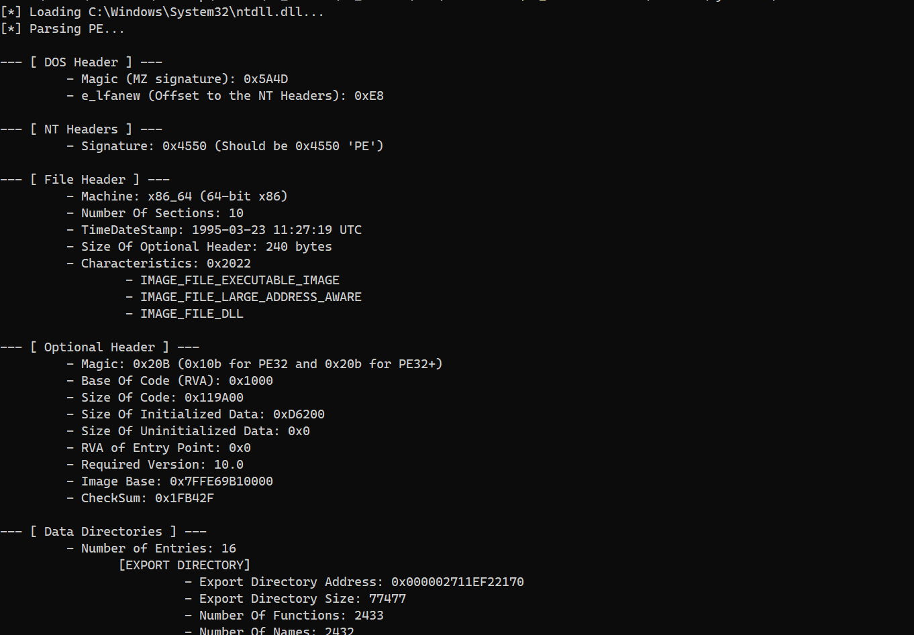

# PE-Parser

A simple PE Parser that extracts inforamtion about Portable Executable files.

## Features

- Parse PE Headers, Directories and Sections.
- Show detail inforamtion about Headers, Directories and Sections.

The parser will analyze and extract information from the following places:

- DOS Header
- NT Headers: File Header and Optional Header
- Data Directories: Export Directory, Import Directory, Resource Directory, etc...
- Sections: .text section, .rsrc section, .data section, etc...

## Credits

- [s4mp0l](https://github.com/s4mp0l)